# OneLedger Data Model – MVP Scope
Focus: Membership, Payments/Billing, Events, Communications, Tenant Configuration (multi-tenant, Phase 1 for Rotary Club of Manila Expats). Aligned with current API specs and service boundaries.

## ERD (high level)

```mermaid
erDiagram
  TENANT ||--o{ USER : "has"
  TENANT ||--o{ ROLE : "defines"
  USER ||--o{ USERROLE : "assigned"
  ROLE ||--o{ USERROLE : "assigned"

  TENANT ||--o{ MEMBER : "has"
  MEMBER ||--o{ MEMBERPROFILEFIELDVALUE : "profile fields"
  TENANT ||--o{ TENANTPROFILEFIELD : "defines fields"
  TENANT ||--o{ TENANTMEMBERSHIPTYPE : "defines types"
  TENANT ||--o{ APPROVALWORKFLOW : "approval rules"

  TENANT ||--o{ PAYMENTMETHOD : "tokenized methods"
  TENANT ||--o{ INVOICE : "issues"
  INVOICE ||--o{ INVOICELINE : "lines"
  INVOICE ||--o{ PAYMENT : "paid by"
  PAYMENT ||--o{ REFUND : "refunds"
  TENANT ||--o{ PAYMENTSCHEDULE : "recurring dues"
  TENANT ||--o{ LATEFEERULE : "late fees"

  TENANT ||--o{ EVENT : "organizes"
  EVENT ||--o{ EVENTREGISTRATION : "registrations"
  EVENT ||--o{ EVENTATTENDANCE : "attendance"
  EVENTREGISTRATION }o--|| PAYMENT : "optional link"

  TENANT ||--o{ BROADCAST : "campaigns"
  TENANT ||--o{ EMAILTEMPLATE : "templates"
  TENANT ||--o{ REMINDERJOB : "reminders"
  MEMBER ||--o{ COMMUNICATIONLOG : "logs"

  TENANT ||--o{ TENANTFEATUREFLAG : "feature flags"
  TENANT ||--o{ TENANTPAYMENTGATEWAY : "gateway config"
  TENANT ||--o{ INVOICETEMPLATE : "invoice template"
  TENANT ||--o{ REMINDERSCHEDULE : "reminder schedule"
  TENANT ||--o{ TENANTBRANDING : "branding"
  TENANT ||--o{ PROJECTTEMPLATE : "project templates"
  TENANT ||--o{ MFA_POLICY : "admin MFA"

  TENANT ||--o{ AUDITEVENT : "audit trail"
```

## Conventions
- All tables/entities are tenant-scoped with `tenant_id`.
- Timestamps: `created_at`, `updated_at`; audit via event/audit logs.
- IDs: surrogate UUIDs unless otherwise required.

## Entities & Key Fields

### Tenant & Configuration
- **Tenant**
  - `id`, `name`, `status`, `timezone`, `locale`, `primary_contact`, `branding_refs`
- **TenantBranding**
  - `id`, `tenant_id`, `logo_url`, `colors`, `email_sender_name`, `email_sender_address`
- **TenantFeatureFlag**
  - `id`, `tenant_id`, `flag_key`, `enabled` (e.g., events_enabled, recurring_payments_enabled)
- **TenantPaymentGateway**
  - `id`, `tenant_id`, `gateway`, `status`, `config_blob` (tokenized/secret refs), `enabled`
- **TenantMembershipType**
  - `id`, `tenant_id`, `name`, `description`, `status`, `category`, `is_default`
- **TenantProfileField**
  - `id`, `tenant_id`, `entity` (member), `field_key`, `field_type` (text/number/date/dropdown), `required`, `options_json`, `visibility`
- **ApprovalWorkflow**
  - `id`, `tenant_id`, `for_entity` (member), `mode` (auto/manual), `rules_json`
- **InvoiceTemplate**
  - `id`, `tenant_id`, `template_ref`, `tax_fields_json`, `footer_text`, `active`
- **ReminderSchedule**
  - `id`, `tenant_id`, `type` (payment_due,event_reminder), `offset_days`, `channel` (email/push), `template_ref`
- **ProjectTemplate**
  - `id`, `tenant_id`, `name`, `category`, `default_fields_json`, `active`
- **MfaPolicy**
  - `id`, `tenant_id`, `admin_mfa_required` (bool), `updated_at`

### Identity & Membership
- **User**
  - `id`, `tenant_id`, `email`, `password_hash`, `mfa_enabled`, `status` (active/inactive), `last_login_at`
- **Role**
  - `id`, `tenant_id`, `name`, `description`
- **UserRole**
  - `user_id`, `role_id`, `tenant_id`
- **Member**
  - `id`, `tenant_id`, `user_id` (nullable for invited), `status` (pending/active/inactive/rejected), `membership_type_id`, `joined_at`
  - Core profile: `first_name`, `last_name`, `email`, `phone`, `address`, `timezone`
- **MemberProfileFieldValue**
  - `id`, `tenant_id`, `member_id`, `field_key`, `field_value`
- **MemberStatusChange**
  - `id`, `tenant_id`, `member_id`, `from_status`, `to_status`, `changed_by`, `reason`, `changed_at`

### Payments & Billing (Invoices/Transactions)
- **PaymentMethod**
  - `id`, `tenant_id`, `member_id`, `provider` (gateway), `token_ref`, `brand`, `last4`, `exp_month`, `exp_year`, `status`
- **Invoice**
  - `id`, `tenant_id`, `member_id`, `status` (draft/sent/paid/voided/overdue/partial), `due_date`, `total_amount`, `currency`, `issued_at`, `paid_at`
- **InvoiceLine**
  - `id`, `invoice_id`, `tenant_id`, `description`, `quantity`, `unit_amount`, `tax_amount`, `total_amount`, `category` (dues/event/other)
- **Payment**
  - `id`, `tenant_id`, `invoice_id` (nullable for immediate payments), `member_id`, `amount`, `currency`, `status` (pending/succeeded/failed/refunded/partial_refund), `provider`, `provider_ref`, `captured_at`
- **Refund**
  - `id`, `tenant_id`, `payment_id`, `amount`, `currency`, `status`, `provider_ref`, `processed_at`
- **PaymentSchedule**
  - `id`, `tenant_id`, `member_id`, `membership_type_id`, `frequency` (monthly/annual), `start_date`, `next_run_at`, `status`
- **LateFeeRule**
  - `id`, `tenant_id`, `applies_to` (dues), `amount_type` (fixed/percent), `amount_value`, `grace_days`

### Events
- **Event**
  - `id`, `tenant_id`, `title`, `description`, `start_at`, `end_at`, `location`, `is_virtual`, `virtual_link`, `status` (draft/published), `capacity`, `waitlist_enabled`, `price_amount`, `currency`
- **EventRegistration**
  - `id`, `tenant_id`, `event_id`, `member_id`, `status` (registered/cancelled/waitlisted/confirmed), `registered_at`, `cancelled_at`, `promotion_at` (from waitlist), `payment_id` (if paid)
- **EventAttendance**
  - `id`, `tenant_id`, `event_id`, `member_id`, `checked_in_at`, `checked_in_by`

### Communications
- **EmailTemplate**
  - `id`, `tenant_id`, `name`, `category` (reminder/broadcast/receipt), `subject_tpl`, `body_tpl`, `is_active`
- **Broadcast**
  - `id`, `tenant_id`, `subject`, `body`, `audience_filter_json`, `status` (draft/scheduled/sent/paused), `scheduled_at`, `sent_at`, `template_id`
- **ReminderJob**
  - `id`, `tenant_id`, `type` (payment_due/event_reminder), `target_ref` (invoice_id/event_id), `member_id`, `status` (scheduled/sent/cancelled), `run_at`, `template_id`
- **CommunicationLog**
  - `id`, `tenant_id`, `member_id`, `channel` (email/push), `type` (broadcast/reminder/receipt), `subject`, `status` (sent/failed), `sent_at`, `metadata_json`

### Reporting (MVP data access)
- Reporting is generated from above entities; no separate OLAP store in MVP. Use read replicas or filtered queries over operational stores.

### Audit / Observability (cross-cutting)
- **AuditEvent**
  - `id`, `tenant_id`, `actor_id`, `entity_type`, `entity_id`, `action`, `before_json`, `after_json`, `created_at`
- Logs/metrics/traces emitted per service (in observability stack).

## Relationships (key)
- Tenant 1—N Members, Users, Config, Events, Invoices, Payments.
- Member 1—N PaymentMethods, Invoices, Payments, EventRegistrations, CommunicationLogs.
- Invoice 1—N InvoiceLines; Invoice 1—N Payments (including partials); Payment 1—N Refunds.
- Event 1—N EventRegistrations; EventRegistrations link to Payments when paid; Event 1—N EventAttendance.
- TenantConfig entities (FeatureFlag, ProfileField, MembershipType, PaymentGateway, InvoiceTemplate, ReminderSchedule) drive behavior across services.

## Alignment with Service Boundaries
- Identity/Auth: User, Role, UserRole, MfaPolicy.
- Config Center: Tenant*, FeatureFlag, PaymentGateway, MembershipType, ProfileField, ApprovalWorkflow, InvoiceTemplate, ReminderSchedule, ProjectTemplate, Branding.
- Membership: Member, MemberProfileFieldValue, MemberStatusChange (uses Roles via Identity).
- Payments & Billing: PaymentMethod, Invoice, InvoiceLine, Payment, Refund, PaymentSchedule, LateFeeRule.
- Events: Event, EventRegistration, EventAttendance (optional Payment link).
- Communications: EmailTemplate, Broadcast, ReminderJob, CommunicationLog.
- Audit/Observability: AuditEvent (+ external logs/metrics/traces).

## Notes for Multi-Tenancy & Extensibility
- Every access path filters by `tenant_id`; migrations enforce tenant_id NOT NULL on shared tables.
- Dynamic fields live in TenantProfileField + MemberProfileFieldValue to avoid frequent schema changes.
- Payment gateway credentials stored tokenized/secret-managed; only references in DB.
- Feature flags and templates allow behavior changes without code deploys.

