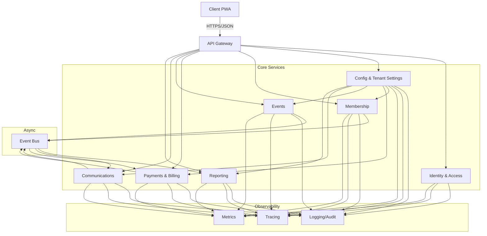

# OneLedger Architecture Overview

Aligned to the PRD (incl. Section 13), MVP stories, and current API specs. Phase 1 target: Rotary Club of Manila Expats.

## 1) High-Level Architecture (Phase 1 focus)

### Request/Reply (synchronous)
- PWA → API Gateway → services: Membership (reg/approval/profile/search), Payments & Billing (pay, invoice, receipt), Events (list/register/cancel/check-in), Communications (broadcast/reminders), Config (tenant settings), Identity (auth).
- Services use Config for per-tenant schemas/flags and Identity for auth/RBAC checks.

### Event-Driven (asynchronous via Event Bus)
- Membership emits `MemberRegistered`, `MemberVerified`, `MemberApproved/Rejected`, `MemberUpdated`, `MemberDeactivated`.
- Payments/Billing emits `InvoiceCreated`, `InvoiceSent`, `PaymentSucceeded`, `PaymentFailed/Retried`, `InvoicePaid`, `RefundProcessed`.
- Events emits `EventCreated`, `EventPublished`, `EventRegistrationCreated/Cancelled/Promoted`, `EventCheckedIn`.
- Communications emits `BroadcastSent`, `ReminderSent`; consumes payment/event/member events for receipts/reminders.
- Reporting consumes all business events for aggregates; Audit consumes all for trails.

## 2) PWA Frontend Structure & Performance
- Installable PWA with service worker caching shell + recent data (member roster, invoices, events).
- Route-level lazy-loading per module (Membership, Payments/Billing, Events, Communications, Reporting, Config).
- Optimized assets (compression, responsive images, HTTP/2/3).
- Client-side caching and optimistic UI for common reads (roster, invoices, events list).
- Push notifications for reminders (payments/events) via Notifications service.

## 3) Microservice Boundaries (Phase 1 scope)
- **Identity & Access**: Auth, MFA (admin), roles/permissions, tenant-scoped JWTs.
- **Config & Tenant Settings**: Org profile/branding, membership types, approval workflows, payment categories, invoice templates, feature flags.
- **Membership**: Registration, verification, approval, profile CRUD, directory search, roles assignment (in conjunction with Identity).
- **Payments & Billing**: Payment methods (tokenized), one-time dues/event payments, recurring dues schedules, invoices, receipts.
- **Events**: Event creation/publish, capacity, registration, cancellation, pricing, attendance basics.
- **Communications**: Broadcast emails, reminders (payment/event), templates, scheduling; integrates with Notifications.
- **Reporting**: Roster, dues collection summary, event attendance; exports.
- **Audit/Observability (cross-cutting)**: Structured logs, audit trails, metrics, tracing.

## 4) Multi-Tenant Isolation Model
- Shared logical databases with `tenant_id` on all rows; option to shard/high-isolate for larger tenants later.
- Tenant-scoped configuration: schemas (profile fields), membership types, payment categories, workflows, feature flags, branding.
- RBAC evaluated per tenant; tokens carry tenant claims.
- Data access layers enforce tenant filters by default; no cross-tenant queries.

## 5) Key APIs Between Services (representative)
- Identity ↔ API Gateway: `POST /auth/login`, `POST /auth/refresh`, `POST /auth/mfa/verify`.
- Config → all services: `GET /config/{tenant}` (cached), `GET /feature-flags/{tenant}`.
- Membership:
  - `POST /members/registrations` (self-registration)
  - `POST /members/registrations/{token}/verify`
  - `POST /members` (admin create)
  - `POST /members/{id}/approve`
  - `POST /members/{id}/reject`
  - `PATCH /members/{id}` (profile update)
  - `POST /members/{id}/photo`
  - `GET /members/search`
- Payments & Billing:
  - `POST /payment-methods` (token capture)
  - `POST /payments` (one-time dues/event)
  - `GET /payments/{id}`
  - `POST /payments/{id}/resend-receipt`
  - `POST /payments/{id}/refund`
  - `GET /transactions`
  - `POST /invoices` (manual)
  - `GET /invoices?member=...`
  - `POST /invoices/{id}/send`
- Events:
  - `POST /events` (draft)
  - `POST /events/{id}/publish`
  - `POST /events/{id}/register`
  - `POST /events/{id}/cancel-registration`
  - `GET /events/upcoming`
  - `GET /events/{id}/attendees`
- Communications:
  - `POST /broadcasts` (draft/send/schedule)
  - `POST /templates`
  - `POST /reminders/payments`
  - `POST /reminders/events`
- Reporting:
  - `GET /reports/roster`
  - `GET /reports/dues-summary`
  - `GET /reports/event-attendance`

## 6) Event Flows (via Event Bus)
- **Membership Events**: `MemberRegistered`, `MemberVerified`, `MemberApproved`, `MemberUpdated`, `MemberDeactivated`.
  - Consumers: Communications (welcome), Reporting (roster), Config (validation), Audit.
- **Payment/Billing Events**: `InvoiceCreated`, `InvoiceSent`, `PaymentSucceeded`, `PaymentFailed`, `PaymentRetried`, `InvoicePaid`, `RefundProcessed`.
  - Consumers: Communications (receipts/reminders), Reporting (dues), Events (if tied to registration), Audit.
- **Communications/Reminder Events**: `ReminderScheduled`, `ReminderSent`, `BroadcastSent`.
  - Consumers: Audit, Reporting (delivery stats), Notifications (push/email channel).

## 7) Data & Storage (high level)
- Primary OLTP stores per service (logical schemas) with tenant scoping.
- Config store (e.g., key-value/doc) for schemas, templates, feature flags.
- Object storage for assets (logos, attachments, invoices PDFs).
- Event bus (e.g., SNS/SQS, Kafka, or NATS) for async flows.

## 8) Observability (Logging, Metrics, Tracing)
- Structured logs with correlation IDs spanning gateway → services.
- Metrics: latency, error rates, throughput per service; business KPIs (payments success, invoice aging, registrations).
- Tracing: distributed tracing on all ingress/egress; sampled in prod with burst-on-error.
- Dashboards & alerts aligned to SLAs in NFRs (p99 latency, availability targets).

## 9) Simplicity for MVP, Extensible Later
- Limit Phase 1 to Membership, Payments/Billing, Events, Communications, Reporting, Config, Identity; defer Donations, advanced Projects, deep analytics.
- Use configuration over code for tenant variation (Config service + feature flags).
- Keep service count lean; Notifications can be part of Communications if needed, and Audit can share the observability stack initially.
- Favor async events for extensibility; keep critical paths (auth, payment charge, registration) synchronous for UX.
- Maintain small PWA bundles via lazy-loading and shared UI components; prioritize critical flows (register, pay dues, register for event).

## 10) Shared Libraries & Cross-Cutting
- Shared lib: DTOs/models, validation, standardized error envelope, auth/tenant middleware, pagination helpers, logging/tracing utilities.
- Cross-cutting: Observability stack (logs/metrics/traces), audit logging, feature-flag client, config client, common HTTP client with retries/timeouts.

## 11) Recommended Stack Choices (pragmatic)
- Backend: Node.js (TypeScript) or Java/Kotlin with Spring Boot; lightweight HTTP frameworks; OpenAPI-first; async messaging via Kafka/NATS/SNS+SQS.
- Frontend: React (TypeScript) PWA; Vite/Next; SW for caching; component lazy-loading; design system with theming per tenant.
- Data: Postgres for OLTP (tenant_id scoping), Redis for cache/session/rate-limit, S3-compatible object storage for assets/PDFs.
- Auth: JWT with tenant claim; optional OAuth2/OIDC gateway; MFA for admins.
- Infra: Containerized (Docker), orchestrated via Kubernetes; API Gateway/Ingress with TLS; IaC via Terraform.

## 12) Deployment Considerations
- Environment separation: dev/stage/prod; per-env config and secrets management (e.g., Vault/SM/KeyVault).
- CI/CD: lint/test/build; image scan; deploy to stage with smoke tests; progressive delivery/blue-green for services with DB migrations gated.
- Database: migrations per service; strong tenant filters; backups and PITR; read replicas for reporting.
- Reliability: health (`/health`) and readiness (`/status`) endpoints; autoscaling based on CPU/RPS/queue depth; circuit breakers and retries on clients.
- Security: TLS everywhere; least-privilege IAM; secrets not in code; audit logs immutable; WAF/rate-limits at gateway.
